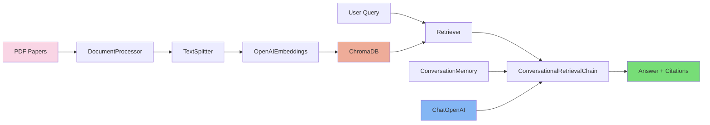

# BioRAG: Intelligent Research Assistant for Oocyte Studies

[](https://biorag-oocyte-36nfepumrpgfwushlci6c2.streamlit.app/)
[](https://github.com/qianxu05172019/BioRAG-Oocyte-Agent)

## Overview

BioRAG is a specialized Retrieval-Augmented Generation (RAG) system designed to assist researchers in oocyte studies and cell-cell communication analysis. It combines advanced NLP technologies with scientific literature processing to provide intelligent, citation-backed research assistance.

## Features

- Semantic search across scientific papers (OmniPath, CellChat, CellPhoneDB, oocyte biology)
- Interactive chat interface with multi-turn conversation support
- Real-time citation tracking with source PDF and page numbers
- Suggested questions for quick exploration
- Auto-builds vector store on first launch (no manual preprocessing needed)
- Deployable on both local and Streamlit Cloud

## Knowledge Base

The system is built on 5 curated research papers:

| Paper | Topic |
|-------|-------|
| OmniPath (Nature Methods, 2016) | Integrated signaling pathway knowledge base |
| OmniPath (NAR, 2025) | Multi-omics biological interaction database |
| CellChat (Nature Communications, 2021) | Cell-cell communication inference from scRNA-seq |
| CellPhoneDB (Nature Protocols, 2020) | Ligand-receptor interaction prediction |
| Metabolomics (Scientific Reports, 2018) | Cumulus cell metabolites and oocyte maturation |

## Technical Architecture

### System Architecture



### Core Components

| Component | Module | Role |
|-----------|--------|------|
| Document Processing | `src/document_loader.py` | PDF loading + recursive text splitting (1000 chars, 200 overlap) |
| Vector Store | `src/embeddings.py` | OpenAI Embeddings (1536-dim) + ChromaDB storage |
| RAG Pipeline | `src/rag_pipeline.py` | Question condensing + retrieval (top-4) + GPT generation |
| Web UI | `app.py` | Streamlit chat interface with citations and suggested questions |

### Project Structure

```
BioRAG-Oocyte-Agent/
├── app.py                 # Streamlit web application
├── process_pdfs.py        # Offline PDF preprocessing script
├── requirements.txt       # Python dependencies
├── src/
│   ├── document_loader.py # PDF loading and text splitting
│   ├── embeddings.py      # Vector store management (VectorStoreManager)
│   └── rag_pipeline.py    # RAG pipeline (accepts vector store via DI)
└── data/
    └── papers/            # Source PDF documents
```

## Deployment

### Live Demo

Access the live application: [BioRAG Oocyte Expert](https://biorag-oocyte-36nfepumrpgfwushlci6c2.streamlit.app/)

### Local Development

#### Prerequisites

- Python 3.10+
- OpenAI API key

#### Installation

```bash
git clone https://github.com/qianxu05172019/BioRAG-Oocyte-Agent.git
cd BioRAG-Oocyte-Agent
pip install -r requirements.txt
```

#### Configuration

Create `.env` in project root:
```
OPENAI_API_KEY=your-api-key
```

#### Run

```bash
# Option 1: Launch the web app (auto-builds vector store on first run)
streamlit run app.py

# Option 2: Pre-build vector store separately
python process_pdfs.py
streamlit run app.py
```

#### Programmatic Usage

```python
from src.document_loader import DocumentProcessor
from src.embeddings import VectorStoreManager
from src.rag_pipeline import RAGPipeline

# Process research papers
processor = DocumentProcessor()
docs = processor.load_pdfs("data/papers")

# Create vector store
vector_store_manager = VectorStoreManager()
vector_store = vector_store_manager.create_vector_store(docs)

# Initialize RAG pipeline
rag = RAGPipeline(vector_store)

# Research query
response = rag.ask("What are the key factors affecting oocyte maturation?")
print(response["answer"])
```

## License

This project is licensed under the MIT License - see the LICENSE file for details.

---
*Developed as a showcase of Machine Learning Engineering and Data Science capabilities, with focus on NLP, RAG systems, and LLM integration in biomedical research.*
