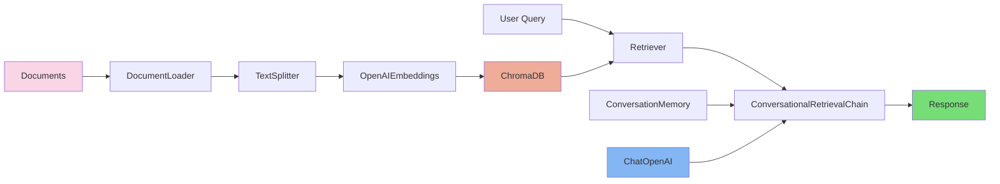

# BioRAG: Intelligent Research Assistant for Oocyte Studies

[](https://biorag-oocyte-36nfepumrpgfwushlci6c2.streamlit.app/)
[](https://github.com/qianxu05172019/biorag-oocyte)

## Overview

BioRAG is a specialized Retrieval-Augmented Generation (RAG) system designed to assist researchers in oocyte studies. It combines advanced NLP technologies with scientific literature processing to provide intelligent research assistance.

## Features

- 🔍 Semantic search across scientific papers
- 💬 Interactive research-focused chat interface
- 📚 Real-time citation tracking
- 🎨 Intuitive user interface
- 📊 Persistent session management
- 🔄 System reset functionality

## Technical Architecture

### Retrieval Mechanism

BioRAG implements a **Representation-based Similarity** approach for document retrieval:

Key characteristics:
- Documents and queries are independently encoded into dense vector representations
- Retrieval is performed through vector similarity matching (e.g., cosine similarity)
- Efficient for large-scale scientific document retrieval
- Optimized for research paper processing
- Implemented using OpenAI embeddings and Chroma vector store

### Core Components

#### 1. Document Processing
```python
class DocumentProcessor:
    def __init__(self):
        self.text_splitter = RecursiveCharacterTextSplitter(
            chunk_size=1000,
            chunk_overlap=200,
            length_function=len
        )
```
- Specialized PDF processor for scientific literature
- Recursive character text splitting
- Optimized chunk size and overlap for research papers

#### 2. Vector Store Management
- ChromaDB integration for similarity search
- Efficient document embedding storage
- Persistent vector database
- Optimized for research paper embeddings

#### 3. RAG Pipeline
- Language Model: GPT-3.5-turbo
- Conversational memory for context retention
- Scientific context-aware retrieval
- Citation-aware response generation

### System Architecture



### Project Structure

```
project/
├── app.py                 # Streamlit application
├── process_pdfs.py        # PDF processing
├── src/
│   ├── document_loader.py # Document processing
│   ├── embeddings.py      # Vector embeddings
│   └── rag_pipeline.py    # RAG implementation
```

## Deployment

### Cloud Deployment

The application is deployed on Streamlit Cloud with:
- Automated GitHub-based deployment
- Secure environment variable management
- Continuous availability
- Protected API key handling

### Local Development

#### Prerequisites

- Python 3.8+
- OpenAI API key
- Dependencies: streamlit, langchain, chromadb, openai

#### Installation

```bash
git clone https://github.com/qianxu05172019/biorag-oocyte.git
cd biorag
pip install -r requirements.txt
```

#### Configuration

1. Create `.env` in project root:
```
OPENAI_API_KEY=your-api-key
```

#### Usage Example

```python
from document_loader import DocumentProcessor
from embeddings import VectorStoreManager
from rag_pipeline import RAGPipeline

# Process research papers
processor = DocumentProcessor()
docs = processor.load_pdfs("path/to/papers")

# Create vector store
vector_store_manager = VectorStoreManager()
vector_store = vector_store_manager.create_vector_store(docs)

# Initialize RAG pipeline
rag = RAGPipeline(vector_store)

# Research query
response = rag.ask("What are the key factors affecting oocyte maturation?")
```

## Future Development

### Planned Features

1. **Enhanced Citations**
   - Detailed tracking system
   - Export functionality
   - Citation network visualization

2. **Analytics Integration**
   - Research trend analysis
   - Document clustering
   - Knowledge graph visualization

3. **System Enhancements**
   - Multi-model support (GPT-4, Claude)
   - Automated metadata extraction
   - Enhanced conversation memory
   - Chat history export

4. **Knowledge Base Updates**
   - Meeting notes integration
   - Experiment results tracking
   - Oocyte stage imaging

## Live Demo

Access the live application: [BioRAG Oocyte Expert](https://biorag-oocyte-36nfepumrpgfwushlci6c2.streamlit.app/)

## Contributing

We welcome contributions! Please submit pull requests for any improvements.

## License

This project is licensed under the MIT License - see the LICENSE file for details.

---
*Developed as a showcase of Machine Learning Engineering and Data Science capabilities, with focus on NLP, RAG systems, and LLM integration in biomedical research.*